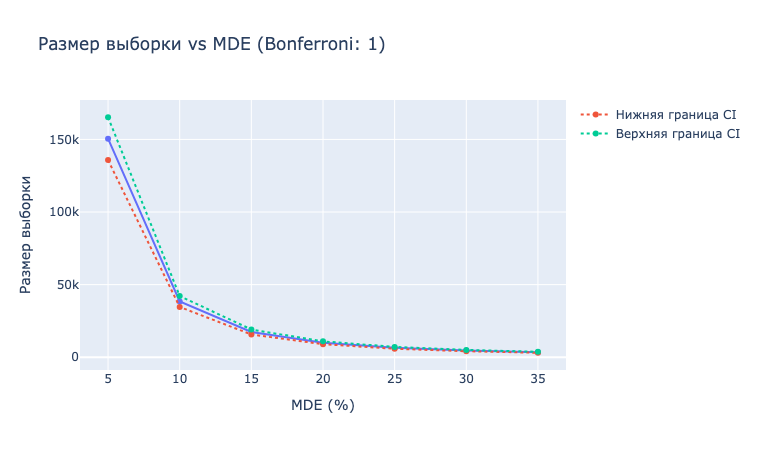

# 📊 SampleSizeCalculator

[](https://pypi.org/project/sample-size-calculator/)
[](https://opensource.org/licenses/MIT)
[](https://www.python.org/)

`SampleSizeCalculator — это Python-класс для расчета необходимого размера выборки в A/B-тестах. Поддерживает расчет по относительному и абсолютному MDE, поправку Бонферонни, непоровну деленный трафик, а также визуализацию зависимости размера выборки от минимального детектируемого эффекта.
🧠 Возможности

    Расчет размера выборки для A/B-тестов:

        по относительному MDE (например, +10%)

        по абсолютному MDE (например, +2 процентных пункта)

    Поддержка:

        Одностороннего и двустороннего теста

        Поправки Бонферонни для множественных сравнений

        Неравного распределения трафика (A/B ≠ 50/50)

    Интерактивная визуализация зависимости размера выборки от MDE (с использованием Plotly)

---

## 📦 Установка

```bash
python3 -m pip install git+https://github.com/Aproject618/sample_size_calculator.git
```

Или, если устанавливаете из исходников:

```bash
git clone https://github.com/Aproject618/sample_size_calculator.git
cd sample-size-calculator
pip install .
```

## 🧪 Пример использования
```Python
calculator = SampleSizeCalculator()
    
# Пример 1: относительный MDE
sample_size = calculator.calculate_sample_size_relative(
    p1=0.1,
    relative_mde=0.1,
    bonferroni_correction=2,
    split_ratio=0.3
)
print(f"Размер выборки на группу: {sample_size}")
    
# Пример 2: абсолютный MDE
sample_size = calculator.calculate_sample_size_absolute(
    p1=0.1,
    absolute_mde=0.02  # p2 = 0.12
)
print(f"Размер выборки на группу: {sample_size}")
```

## 📈 Визуализация
```Python
calculator.sample_size_plot(
    p1=0.1,
    mde_list=[0.01, 0.05, 0.1, 0.15, 0.2],
    relative=True,
    split_ratio=0.5
)
```
[](https://www.python.org/)
## ⚙️ Аргументы

Методы calculate_sample_size_relative и calculate_sample_size_absolute принимают следующие параметры:
| Параметр                | Тип     | Описание                                                              |
| ----------------------- | ------- | --------------------------------------------------------------------- |
| `p1`                    | `float` | Базовая конверсия (от 0 до 1)                                         |
| `relative_mde`          | `float` | Минимальный детектируемый эффект в относительных единицах             |
| `absolute_mde`          | `float` | То же самое, но в абсолютных единицах                                 |
| `alpha`                 | `float` | Уровень значимости, по умолчанию 0.05                                 |
| `power`                 | `float` | Мощность теста, по умолчанию 0.8                                      |
| `two_tailed`            | `bool`  | Двусторонний тест, по умолчанию `True`                                |
| `bonferroni_correction` | `int`   | Кол-во сравнений для поправки Бонферонни (1 — без поправки)           |
| `split_ratio`           | `float` | Доля трафика, направляемая в тест (например, 0.3 для 30% на группу B) |


## 📌 Применение

    Планирование A/B и сплит-тестов

    Оценка трафика, необходимого для выявления эффекта

    Учёт MDE и множественных гипотез в экспериментах

## 🔧 Зависимости

    scipy

    numpy

    plotly

## 🧾 Лицензия

Лицензировано под MIT License.

## ✍️ Автор

Разработано с заботой об аналитиках и продуктовых командах ❤️
Ramis Sungatullin